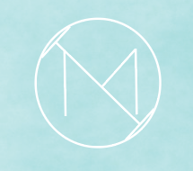

<!--# 2223-9th-grade-sprint-math-games-icemath
2223-9th-grade-sprint-math-games-icemath created by GitHub Classroom-->
<h1 align="center">Hi There, We are <a href="https://github.com/codingburgas/2223-9th-grade-sprint-math-games-icemath">Icemath👋</a></h1>

<p align = "center">
	
</p>

<h2>🚀 Our Information </h2>

- We are studying in vocational school for computer programing and inovation!
- We are interested in programing!

## 📋 Description
The aim of our application is to help with learning betwise operation. There are 12 random questions in the application itself. When you answer correctly you get 1 point.

## 🔧 Tools  
<p align="left" >
<a>  </a> 
<a href="https://visualstudio.microsoft.com/"></a>
<a href="https://www.microsoft.com/en-us/microsoft-365/powerpoint">
	<a>   </a>
    <a href="https://www.microsoft.com/en-us/microsoft-365/excel"></a>
    <a href="https://git-scm.com/"></a>
    <a href="https://git-scm.com/"></a>
      <a>  </a> 
  </p>
  
  ## 💼 Documents
<ul>
	<li> <a href = "Documentation/Documentation_Icemath.docx"> Documentation </a></li>
	<li> <a href = "Documentation/Presentation_Icemath.pptx"> Presentation </a></li>
</ul>
  
  ## 📥 Installation
  ```
  You can download our project by using the green "Code" button.
  ```
   
  ## 🏆 Our Team
  
  * **Nikoleta Ruseva** - *Scrum trainer*
  * **Kaloyan Georgiev** - *Backend developer*
  * **Mariela Dimova** - *Frontend developer*
  * **Bilyana Badalova** - *QA Engineer*
